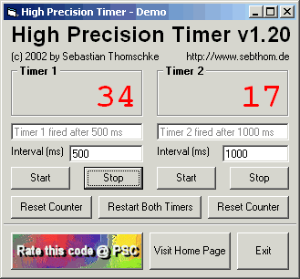

<div align="center">

## High Precision Timer esp\. for Multimedia Applications \[Updated 05/07/02\]


</div>

### Description

This code is a VB implementation of the high precision multimedia timer which can be found

in the winmm.dll. 

----

I wrote this code because of the same reason I created my multiple undo implementation: I wanted to have a smart solution that can be easily added to different VB projects,

that doesn't clutter the code, that doesn't let depend my project on another custom

OCX or DLL file and that is object oriented as much as possible. 

----

The demo project's intension is NOT to show that the multimedia timer is or is not more accurate than the standard VB timer. It's primary task is just to show how to use the timer class and how to instantiate and handle more than one timer object. 

----

For more information have a look at the readme.txt please. -- NEW: I added a high precision profiler class. -- NEW: UserControl instead of class file. Doesn't crash anymore when run compiled. Much easier handling.
 
### More Info
 


<span>             |<span>
---                |---
**Submitted On**   |2002-05-08 13:01:44
**By**             |[x\-treme](https://github.com/Planet-Source-Code/PSCIndex/blob/master/ByAuthor/x-treme.md)
**Level**          |Intermediate
**User Rating**    |4.7 (52 globes from 11 users)
**Compatibility**  |VB 5\.0, VB 6\.0
**Category**       |[VB function enhancement](https://github.com/Planet-Source-Code/PSCIndex/blob/master/ByCategory/vb-function-enhancement__1-25.md)
**World**          |[Visual Basic](https://github.com/Planet-Source-Code/PSCIndex/blob/master/ByWorld/visual-basic.md)
**Archive File**   |[High\_Preci80699582002\.zip](https://github.com/Planet-Source-Code/x-treme-high-precision-timer-esp-for-multimedia-applications-updated-05-07-02__1-34374/archive/master.zip)

### API Declarations

```
'Several. Look at the code, please.
```


